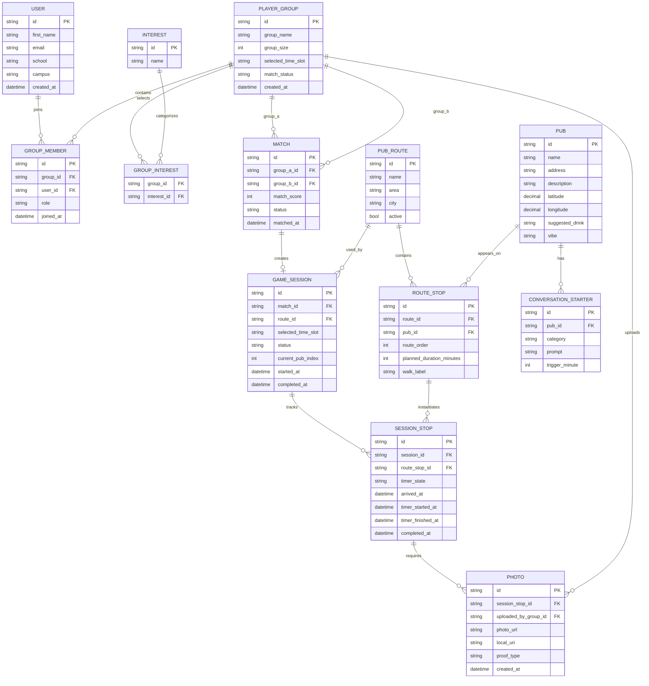

# ERD - Pub Hopper Blaak

Dit ERD beschrijft een toekomstige database-structuur voor de Pub Hopper Blaak app. De huidige MVP gebruikt nog mock data en AsyncStorage, maar deze structuur is geschikt voor een backend met accounts, matchmaking, routes, timers en foto-opslag.

## Belangrijkste Entiteiten

### User
Een student die de app gebruikt. In de MVP is er nog geen login, maar bij een echte backend is dit nodig voor accounts, groepsleden en foto-eigenaarschap.

### PlayerGroup
De groep waarmee studenten meedoen. Een groep heeft 4 tot 8 personen, een gekozen tijdslot, interesses en een matchstatus.

### GroupMember
Koppelt gebruikers aan een groep. Hierdoor kan een groep meerdere studenten bevatten.

### Interest en GroupInterest
Interesses worden los opgeslagen zodat matchmaking later flexibel kan blijven. Een groep kan meerdere interesses kiezen.

### Match
Legt vast welke twee groepen aan elkaar gekoppeld zijn, inclusief matchscore en status.

### GameSession
De daadwerkelijke pub hopper game. Deze start na een match en houdt bij welke route wordt gespeeld, wat de status is en bij welke pub de spelers zijn.

### PubRoute, Pub en RouteStop
De route bestaat uit 5 pubs. `RouteStop` bepaalt de volgorde, looptijd en geplande duur per pub. Hierdoor kan dezelfde pub later in meerdere routes voorkomen.

### SessionStop
De voortgang van één specifieke sessie bij één pub. Hier worden timerstatus, aankomsttijd en voltooiing bijgehouden.

### ConversationStarter
Vragen of opdrachten per pub. `trigger_minute` bepaalt wanneer de prompt verschijnt, bijvoorbeeld minuut 0, 5, 10 of 15.

### Photo
Foto die na een pub wordt toegevoegd als bewijs of herinnering. In de MVP is dit een lokale URI; in een backend wordt dit waarschijnlijk een `photo_url`.

## Relaties Kort Uitgelegd

- Eén groep heeft meerdere groepsleden.
- Eén groep kiest meerdere interesses.
- Eén match koppelt twee groepen.
- Eén match kan één game session starten.
- Eén game session gebruikt één route.
- Eén route bestaat uit meerdere route stops.
- Eén route stop verwijst naar één pub.
- Eén game session heeft meerdere session stops.
- Eén session stop vereist minimaal één foto.
- Eén pub kan meerdere conversation starters hebben.

## MVP vs Backend

In de huidige MVP worden deze gegevens nog niet in een database opgeslagen. De app gebruikt:

- mock pubs;
- mock groups;
- lokale session state;
- AsyncStorage;
- lokale foto-URI’s.

Voor een echte backend zouden vooral deze tabellen als eerste nodig zijn:

1. `PLAYER_GROUP`
2. `INTEREST`
3. `GROUP_INTEREST`
4. `MATCH`
5. `GAME_SESSION`
6. `PUB_ROUTE`
7. `PUB`
8. `ROUTE_STOP`
9. `SESSION_STOP`
10. `PHOTO`

`USER` kan later worden toegevoegd als de app login of persoonlijke profielen krijgt.
