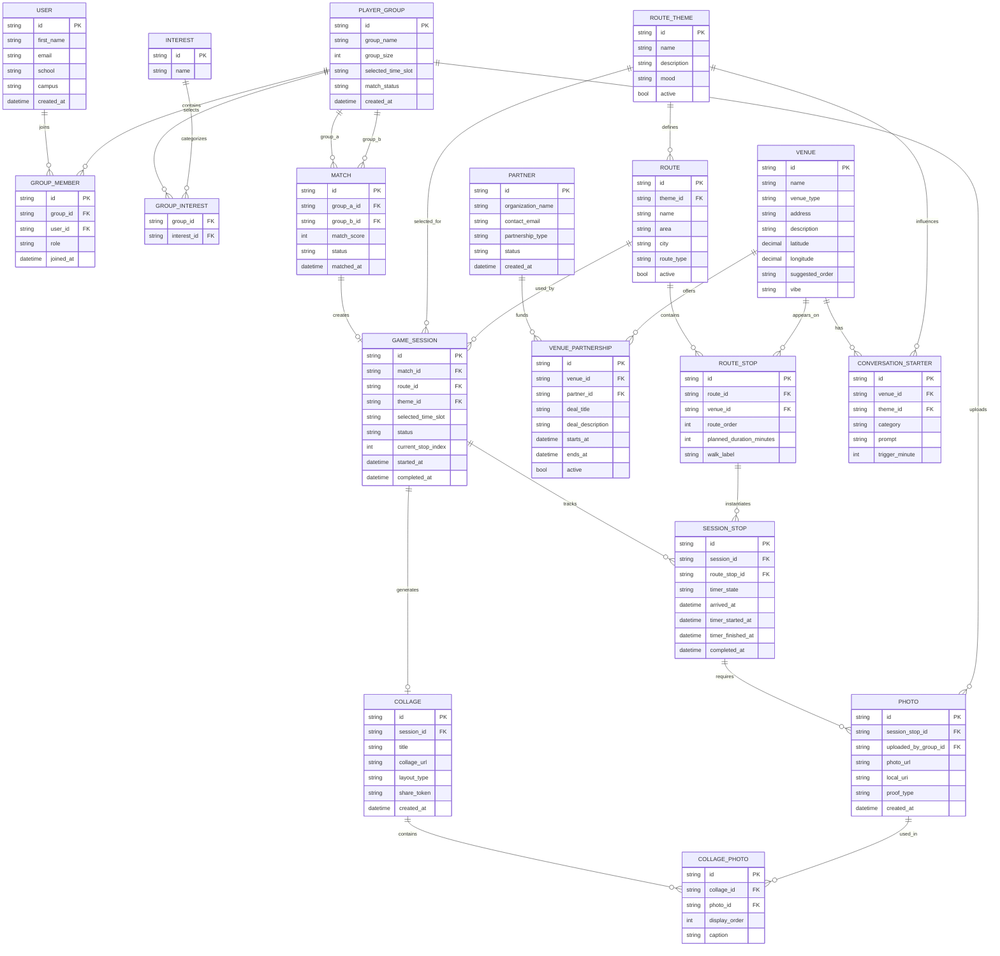

# ERD - Pub Hopper Blaak

Dit ERD beschrijft een toekomstige database-structuur voor de Pub Hopper Blaak app. De huidige MVP gebruikt nog mock
data en AsyncStorage, maar deze structuur is geschikt voor een backend met accounts, matchmaking, themaroutes,
partnerships, timers, foto-opslag en een collage/recap na afloop.

## Belangrijkste Entiteiten

### User

Een student die de app gebruikt. In de MVP is er nog geen login, maar bij een echte backend is dit nodig voor accounts,
groepsleden en foto-eigenaarschap.

### PlayerGroup

De groep waarmee studenten meedoen. Een groep heeft 4 tot 8 personen, een gekozen tijdslot, interesses en een
matchstatus.

### GroupMember

Koppelt gebruikers aan een groep. Hierdoor kan een groep meerdere studenten bevatten.

### Interest en GroupInterest

Interesses worden los opgeslagen zodat matchmaking flexibel blijft. Een groep kan meerdere interesses kiezen.

### Match

Legt vast welke twee groepen aan elkaar gekoppeld zijn, inclusief matchscore en status.

### GameSession

De daadwerkelijke pub hopper game. Deze start na een match en houdt bij welke route en welk thema wordt gespeeld, wat de
status is en bij welke stop de spelers zijn.

### RouteTheme

Een thema dat studenten kunnen kiezen voordat de route start. Hierdoor hoeft de app niet alleen pubroutes aan te bieden.

Voorbeelden:

- Pub
- Cafe route
- Culture walk
- Park walk

Het gekozen thema kan bepalen welke venues worden getoond, welke conversation starters verschijnen en welke sfeer de
route heeft.

### Route, Venue en RouteStop

De route bestaat uit 5 stops. In plaats van alleen `PUB` gebruikt het model nu `VENUE`, zodat een route ook cafes,
koffiezaken, lunchplekken, culturele plekken of alcoholvrije locaties kan bevatten.

`RouteStop` bepaalt de volgorde, looptijd en geplande duur per venue. Hierdoor kan dezelfde venue later in meerdere
routes of thema's voorkomen.

### Partner en VenuePartnership

Deze tabellen ondersteunen partnerships met pubs, cafes of andere locaties. Een partner kan bijvoorbeeld betalen voor
zichtbaarheid, een student deal aanbieden of een gesponsorde challenge toevoegen.

Voorbeelden:

- student discount;
- first drink deal;
- mocktail deal;
- coffee deal;
- sponsored photo challenge;
- featured venue placement;
- intro-week partnership.

### SessionStop

De voortgang van een specifieke sessie bij een route stop. Hier worden timerstatus, aankomsttijd en voltooiing
bijgehouden.

### ConversationStarter

Vragen of opdrachten per venue en eventueel per thema. `trigger_minute` bepaalt wanneer de prompt verschijnt,
bijvoorbeeld minuut 0, 5, 10 of 15.

Daardoor kan dezelfde locatie andere prompts krijgen bij verschillende thema's. Een cafe-route kan bijvoorbeeld
rustigere vragen hebben dan een nightlife-route.

### Photo

Foto die na een stop wordt toegevoegd als bewijs of herinnering. In de MVP is dit een lokale URI; in een backend wordt
dit waarschijnlijk een `photo_url`.

### Collage en CollagePhoto

Na de laatste stop kan de app automatisch een collage of recap genereren. `COLLAGE` hoort bij een game session.
`COLLAGE_PHOTO` bepaalt welke foto's in de collage staan, in welke volgorde, en met welk onderschrift.

Dit ondersteunt de feature waarbij studenten na afloop hun route kunnen terugzien als herinnering.

## Relaties Kort Uitgelegd

- Een groep heeft meerdere groepsleden.
- Een groep kiest meerdere interesses.
- Een match koppelt twee groepen.
- Een match kan een game session starten.
- Een game session gebruikt een route en een gekozen thema.
- Een thema kan meerdere routes beinvloeden.
- Een route bestaat uit meerdere route stops.
- Een route stop verwijst naar een venue.
- Een venue kan een pub, cafe, koffiezaak of andere sociale plek zijn.
- Een venue kan meerdere partnerships of deals hebben.
- Een game session heeft meerdere session stops.
- Een session stop vereist minimaal een foto.
- Een venue kan meerdere conversation starters hebben.
- Een game session kan een collage genereren.
- Een collage bevat meerdere foto's.

## MVP vs Backend

In de huidige MVP worden deze gegevens nog niet in een database opgeslagen. De app gebruikt:

- mock venues;
- mock themes;
- mock groups;
- lokale session state;
- AsyncStorage;
- lokale foto-URI's.

Voor een echte backend zouden vooral deze tabellen als eerste nodig zijn:

1. `PLAYER_GROUP`
2. `INTEREST`
3. `GROUP_INTEREST`
4. `MATCH`
5. `GAME_SESSION`
6. `ROUTE_THEME`
7. `ROUTE`
8. `VENUE`
9. `ROUTE_STOP`
10. `SESSION_STOP`
11. `PHOTO`
12. `COLLAGE`

Voor partnerships zijn daarna nodig:

1. `PARTNER`
2. `VENUE_PARTNERSHIP`

Voor een uitgebreidere collage-feature is daarnaast nodig:

1. `COLLAGE_PHOTO`

`USER` kan later worden toegevoegd als de app login of persoonlijke profielen krijgt.
